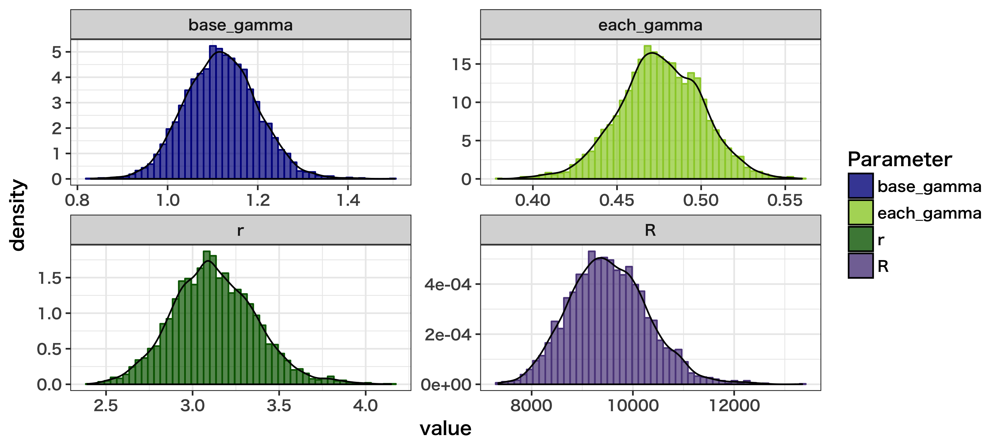

```{r setup, include=FALSE}
knitr::opts_chunk$set(echo = TRUE, warning = FALSE, message = FALSE, error = FALSE)
```


```{css,echo = F}
body, td {
   font-family: sans-serif;
   background-color: white;
   font-size: 14px;
   margin: 0px;
   paddin: 0px;
}

h1{
    font-family: serif;
    font-size: 24pt;
}

h2,h3,h4{
    font-family: serif;
    font-size: 18pt;
}

h3,h4{
    font-family: serif;
    font-size: 14pt;
}


tt{
    margin:0em -1em;
    font-size: 64px;
    color: white;
    background-size:cover;
}
div.title {
    font-family: serif;
    font-size: 50pt;
    width:95%;
    height: 250px;
　  margin:0em 1em;
    background-size:cover;
    background-image:url(https://mrunadon.github.io/images/title.png);
}

```


<font size = "2"> [画像の出展(https://poseidonhd.com/tvshows/violet-evergarden/)](https://poseidonhd.com/tvshows/violet-evergarden/)</font>


# Introduction

本稿は、第70回 Tokyo.R 『ベイズ・統計モデリング』 応用セッションへのエントリーです。応用セッションで紹介させていただいたベイズ統計モデリングの実践例を解説します。発表スライドは非公開ですが、本記事の方が情報量が多いため、その点どうかご容赦くださいませ。

本稿で利用した解析スクリプト、stanファイル、一時保存データなどは、全て[**GitHub**](https://github.com/MrUnadon/ForReproducibility)に置いてあります。VioretEvargardenというフォルダです。再現実験やトレーニングにご活用くださいませ。


# Topics

1. ヴァイオレット・エヴァーガーデン(Violet Evergarden)
2. Twitterフォロワー数の取得(Collect Twitter Data)
3. ローデータの可視化(Data Visualization)
4. データ生成メカニズムと統計モデリング(Statistical Modeling)
5. Stan用のデータ整形(Data Preparation for Stan)
6. Stanによる統計モデルの実装(Stan Model)
7. 結果の確認と可視化(Result)
8. 総括(Conclusion)


#### Libraries

本稿で使用する各種ライブラリです。事前のインストールをお願い致します。

```{r}
# libraries
library(RCurl) # API叩く時に
library(rlist) # list操作
library(rjson) # json操作
library(tidyverse) # tidyパッケージたち(主にデータ整形dplyr&tidyrと可視化ggplot2)
library(lubridate) # 時間変数の操作
library(anytime) # 時間変数の操作
library(formattable) # HTML表
library(DT) # HTML表
library(scales) # dat_breaks()でggplot2の時間ラベル
library(shinystan) # stan結果確認と収束診断
library(ggmcmc) # stan可視化とサンプル取り出し
library(rstan) # stan
# stan並列化とコンパイル上書き
options(mc.cores = parallel::detectCores())
rstan_options(auto_write = TRUE)
```

<hr>

<hr>

## 1. ヴァイオレット・エヴァーガーデン(Violet Evergarden)

<iframe width="100%" height="500" src="https://www.youtube.com/embed/0CJeDetA45Q" frameborder="0" allow="autoplay; encrypted-media" allowfullscreen></iframe>

本稿では、2018年冬期放送のアニメーション作品『ヴァイオレット・エヴァーガーデン』のTwitterフォロワー数をテーマに取り上げます。本作品は全13話から構成されており、放送期間は2018年の1月10日から同年4月4日でした。京都アニメーション大賞を受賞。絵がとっても綺麗で、作中の人物に心が惹かれます。当期のNo.1アニメだったと言えるかもしれません。個人的には本作品が一番のお気に入りでした。

あらすじや詳細は、[**ヴァイオレット・エヴァーガーデン公式サイト**](http://violet-evergarden.jp/)を御覧ください。

## 2. Twitterフォロワー数の取得(Collect Twitter Data)

ヴァイオレット・エヴァーガーデンには、[**公式のTwitterアカウント**](https://twitter.com/Violet_Letter)があります。フォロワー数7万6065人(2018年5月7日時点)！！スゴイですね。どのようにフォロワー数というのは増えていくのでしょうか。確認したいと思います。

[**アニメ公式Twitterアカウントのフォロワー数のログを取っている有り難いAPI**](https://github.com/Project-ShangriLa/sora-playframework-scala)がありますので、こちらからデータを取得したいと思います。また、本APIをRから操作する際の方法は、[**いずにゃんの研究日記**](http://izunyan.hatenablog.com)にまとめられています。あわせてご参照くださいませ。


それでは、ヴァイオレット・エヴァーガーデン公式アカウントフォロワー数のデータ取得から行っていきます。

#### Master情報の取得

まずは、Master情報を取得します。どんなデータがあって、どのようなkeyで引き出さなければならないのか。確認します。

```{r}
# Referrence
  # http://izunyan.hatenablog.com/
  # https://github.com/Project-ShangriLa/sora-playframework-scala

#アニメの放送年:ベクトル(複数指定可)
yearsBC<-c(2018)
#アニメシーズン:ベクトル（1=冬、2=春、3=夏、4=秋: 複数指定可能）
seasons<-c(1)
#現在から何時間前までのデータを取得するか
endTime<-c(1)
#50時間 ✕ 何回分のデータを取得するか
samplings<-c(56)
  # as.POSIXct("2018-05-06") - as.POSIXct("2018-01-08") # データ取得日(5月6日)から、APIデータ記録開始の1月8日まで
  # 118 * 24 / 50 # 50時間を1単位で何回取ればよいか

# Masterデータを取得し、Twitter公式アカウント名とアニメ名を取り出す
master<-data.frame(matrix(NA,0,4))
for(i in 1: length(yearsBC)){
  for(j in 1: length(seasons)){
    tmpFull <- paste("http://api.moemoe.tokyo/anime/v1/master",yearsBC[i],seasons[j],sep = "/") %>% 
      sprintf("Array") %>%
      list.load() %>% list.ungroup() 
    N_anime<-length(tmpFull)/15
    for (k in 1:N_anime){
      tmpTwAcName<-unlist(tmpFull[c((k*15)-13)][1])
      tmpAnime<-unlist(tmpFull[c((k*15)-11)][1])
      master[(length(master[,1])+1),]<-c(yearsBC[i],j,tmpTwAcName,tmpAnime)
    }
  }
}

# マスター情報の確認
DT::datatable(master[33:35,])
```


ヴァイオレット・エヴァーガーデンのアカウント名は33番目あたりでしょうか。"Violet_Letter"というアカウント名を使ってデータを引き出します。

#### Followerデータの取得

```{r, eval = FALSE}
# endpointの決定
subtract_UNIXtime<-c()
for(t in 1:samplings){subtract_UNIXtime[t]<-c((((60*30*100)*t)-(60*30*100))-3)}
end<-c(as.numeric(Sys.time())-c(endTime*60))
endP<-round(c(end-subtract_UNIXtime)-180000,0)

# Follower Historyの抽出(ヴァイオレット・エヴァーガーデン)
FollowerHistory<-data.frame(matrix(NA,0,5))
for(t in 1: samplings){
  tmpRes <- paste("http://api.moemoe.tokyo/anime/v1/twitter/follower/history?account=Violet_Letter&end_date=",endP[t],sep="") %>%
    sprintf("account") %>%
    list.load("") %>% list.ungroup()
  for(u in 1 : (length(tmpRes) / 2 )){
    FollowerHistory[(length(FollowerHistory$X1)+1),]<-c(2018,1,"ヴァイオレットエヴァーガーデン",as.numeric(unlist(tmpRes[[2*u]][1])),as.numeric(unlist(tmpRes[[(2*u)-1]][1])))
  }
}
```

これで、データの取得自体は完了です。

#### ローデータの整形

早速フォロワー数の推移を見たいところですが、データの整形が必要です。欠損やUNIX時間が含まれていたりするので、少し回りくどい整え方になっています。放送日の間歇データをjoinするのも、ちょっと手間ですね。読みにくくてすみません。

```{r, eval =FALSE}
#データの列名や時間情報を整理
base <- data.frame(Date = as.Date(seq(as.POSIXct("2018-01-09"), as.POSIXct("2018-05-07"), by = "days")))
TidyAnime<- FollowerHistory %>% 
  dplyr::mutate(Year = as.integer(X1),
                Season = as.integer(X2),
                Anime = as.factor(X3),
                UnixTime = as.integer(X4),
                Follower = as.integer(X5)) %>%
  dplyr::mutate(Time = as.POSIXct(as.Date(anytime(as.numeric(UnixTime),tz = "Asia/Tokyo"))),
                Date = lubridate::date(Time)
  ) %>%
  dplyr::select(Year, Season, Anime, Time, Date, Follower) %>%
  dplyr::group_by(Date) %>%
  dplyr::arrange(desc(Time), .by_group = TRUE) %>%
  dplyr::distinct(Date, .keep_all = TRUE) %>%
  dplyr::ungroup() %>%
  dplyr::right_join(base) %>%
  dplyr::full_join(data.frame(Date = lubridate::date(as.POSIXct(c("2018-01-09"))) + (seq(1:13) * 7 - 6),
                              OnAir = rep(1),
                              OnAirDate = lubridate::date(as.POSIXct(c("2018-01-09"))) + (seq(1:13) * 7 - 6))
  ) %>%
  dplyr::arrange(Date) %>%
  tidyr::replace_na(list(OnAir = 0)) %>%
  tidyr::fill(Year, Anime, Season, .direction = "down") %>%
  dplyr::filter(Date > as.POSIXct("2018-01-08") & Date < as.POSIXct("2018-04-18"))%>%
  dplyr::mutate(OnAir = ifelse(OnAir == 1, "放送日", "非放送日")) %>%
  as.data.frame()

# .Rdataで保存
save(TidyAnime, file = "data/TidyAnime.Rdata")
```

本APIは、指定した期間で取得できるデータの量に制限があります。今回は「今日から50時間前まで」「50時間まえから100時間前まで」...と、データ取得日に依存してしまう取得の方法を採用しています。よって、解析結果を再現できるように取得したデータを.Rdataで保存し、読み込んで使います。

再現性のために.Rdataを共有します。

.Rdataだけを必要とする場合は、下記からダウンロードし、読み込んでください。

[**TidyAnime.Rdataのダウンロード先(うなどんGitHub)**](https://github.com/MrUnadon/ForReproducibility/blob/master/VioletEvergarden/data/TidyAnime.Rdata)


#### データの確認

保存したデータを読み込みます。

画面の都合上、いくつかの変数に絞って提示します。

```{r}
load(file = "data/TidyAnime.Rdata")
DT::datatable(TidyAnime %>% dplyr::select(1:3, Date, Follower, OnAir))
```


これで、ベースのデータセットが整理出来ました。

## 3. ローデータの可視化(Data Visualization)

### フォロワー数の推移

フォロワー数の経時的な変化を可視化します。まずは、第一弾の特徴理解です。

```{r, eval = FALSE}
# フォロワー数のトレンド
g1 <- ggplot(TidyAnime) + 
  theme_bw(base_size = 12, base_family = "HiraKakuProN-W6") +
  geom_line(aes(x = Time, y = Follower), colour = "darkgray") +
  geom_point(aes(x = Time, y = Follower)) +
  scale_x_datetime(expand = c(0.01, 0.01), breaks = scales::date_breaks("7 days")) +
  theme(axis.text = element_text(hjust = 1, angle = 45)) +
  scale_colour_manual(values = c("#6495ED", "#CD2626")) +
  labs(title = "ヴァイオレット・エヴァーガーデンのフォロワー数推移",
       subtitle = "放送開始1月10日-放送修了4月4日",
       x = "Date") +
  geom_vline(xintercept = c(as.POSIXct("2018-01-10"), as.POSIXct("2018-04-04")), linetype = 2)
# 描画
print(g1)
```


グラフを視ると、放送開始から放送終了日までフォロワー数は一貫して増加傾向にあることが見て取れます。
いくつか、フォロワー数の上がり方が急激なポイントがありますね。

また、右の破線数日前の所は、なんとデータが欠損しています。


### フォロワー増加数の推移

今回の解析では、上記のデータから”日別の増加数”を算出し、それを解析に利用していきます。

"フォロワーが増減するメカニズム"を考えるにあたっては、”フォロワー増加数”のトレンドを見たほうが、直接的だからという理由です。

```{r}
# フォロワー増加量のトレンド
delta_df <- TidyAnime %>% #増加量を追加して、ラグによる欠損が出た1月9日を除外
  dplyr::mutate(lag_Follower = dplyr::lag(Follower))%>%
  dplyr::mutate(delta = Follower - lag_Follower)%>%
  dplyr::filter(Date > as.POSIXct("2018-01-09"))
```

上で作った日別の増加数を、下のコードで可視化します。いくつかカラーリングや、実践破線を挿入して着眼ポイントを強調しています。

```{r, eval=FALSE}
g2  <- ggplot(delta_df) + 
  theme_classic(base_size = 8,base_family = "HiraKakuProN-W6")+
  geom_vline(aes(xintercept = as.POSIXct(OnAirDate)), linetype = 1, colour = "gray")+ 
  geom_vline(aes(xintercept = as.POSIXct(as.Date(OnAirDate) + 1)), linetype = 2, colour = "gray")+ 
  geom_hline(yintercept = 0,size=0.3,linetype=2,colour="gray50")+
  geom_line(aes(x=as.POSIXct(Time),y=delta), colour = "gray20")+
  geom_point(aes(x=as.POSIXct(Time),y=delta, colour = OnAir))+
  scale_x_datetime(expand = c(0.01, 0.01), breaks = scales::date_breaks("7 days"))+
  theme(axis.text = element_text(hjust = 1, angle = 45)) +
  scale_colour_manual(values = c("#6495ED", "#CD2626")) +
  labs(title = "ヴァイオレット・エヴァーガーデンのフォロワー増加数推移",
       subtitle = "実線 = 放送日, 破線 = 放送翌日",
       x = "Date") + 
  theme(legend.position = "bottom", legend.direction = "horizontal") 

# 描画
print(g2)
```


本図は、放送開始から終了後2週間程度の、日別フォロワー増減数をグラフ化したものです。
まず、赤点は「放送日のフォロワー増加数」です。実践の縦線は放送日を示します。

その翌日は、当然ですが放送日の翌日を示します。アニメ『ヴァイオレット・エヴァーガーデン』は深夜帯に放送されるアニメですので、必然アニメの放映を受けてアカウントをフォローした方は、翌日のフォロワー数にカウントされます。

なお、放送最終回となる4月4日と、その前8日程度は、放送日を含めたフォロワー増加数のデータが欠損しています。確認してみましたが、どうしても抜けます。


## 4. データ生成メカニズムと統計モデリング(Statistical Modeling)

さて、統計モデリングではデータの特徴と背景情報を最大限に活用し、「どのような過程を経てそのデータが生成されてきたのか」データ生成メカニズムを考えます。

可能な限りシンプルで、説得力のあるメカニズムが望ましいと言えるかもしれません。そのアイデアを、そのまま統計モデルとして数式や確率分布に落とし込めるからです。

データの生成メカニズムをモデル化することで、データの予測や説明、解釈に繋げていきます。

### Twitterフォロワー増加の生成メカニズム

もちろん、たくさんのメカニズムの考え方があると思いますが、ここではその一例をお示しします。

本稿では4つのメカニズムを考えます。前提として、「本編の放映はフォロワー増加の効果を持つ」ということを暗黙に敷いておきます。

#### メカニズム1. 【全放送を通じて】アニメ放映がフォロワー増加に与える効果は、放送開始後から減少していく

赤い点を繋げて見てください。放送の最初は、放送日に大きなフォロワー増加が得られています。この放送が持つ影響力が、放映が進むに連れて小さくなっていくというのがこの仮定です。理由は２つあり、まずは、獲得できる集団に限りがあるためです。一度フォローすれば次時点でフォロワーの増加数にはなれないため、放送が進むに連れてフォロワーの増加数は減少するという見方です。もう一つは、各話のインパクトです。放送も半ばになると、それは”話の続き”や”各論的な挿話”が中心になりますので、初回ほどフォロワー獲得には貢献しにくいという側面をかんがえることができます。あくまで、"想像"ですが。

数式にすると、次のように表現することが(一例として)可能です。ここでは双極関数を使って、赤の点を繋いでいくイメージです。

$$ 
\mu_{base} = \frac{Intercept}{1 + \gamma_{base}\cdot Term}
$$

ここで、$\mu_{base}$は赤点の予測値です。InterceptはY軸との交点。Term(アニメの話数)が増加するごとに、カーブを描いて減少するトレンドが表現されます。

このとき、各水色ラインの減少カーブの急さを決めるパラメータが、$\gamma_{base}$です。値が大きいほど、減少トレンドが急激になります。


#### メカニズム2. 【各話のレベルで】アニメ放送がフォロワー増加に与える効果は、6日間で減少していく

次は、赤の点で区切られた区間それぞれの、水色の点を御覧ください。放送日の次の日から、次の放送日前日までのフォロワー増加数トレンドです。ここをみてみると、放送日後は次の放送まで急激なカーブを描いた減少トレンドが観察されます。これも当然ではありますが、「ある回の放送がフォロワー増加に与える効果は、放送日から日数が経つほど小さくなる」と考えられます。放送後スグだとフォローする効果が大きいが、5日前の放送の影響でフォローする人は少ない、という見方です。

数式で表現すると、次のように(一例として)表現できます。上の様に双極関数で捉えても良いですが、ここは違うパターンとして、指数関数で表現してみます。

$$
\mu_{each} = \mu_{base} \cdot r \cdot \gamma_{each} ^ {T-1}
$$

ここで、$\mu_{base}$は水色点を予測する期待値を示します。事項で説明しますが、 赤点の予測値$\mu_{base}$を$r$倍します。これで、放送日翌日のフォロワー増加数を求めています。そこ(翌日)から、日数($T$)が経過するに連れて値が現象していくというトレンドを表現しています。T-1なのは、2日目からの減少トレンドとなることを考慮しています。

このとき、各水色ラインの減少カーブの急さを決めるパラメータが、$\gamma_{each}$です。値が小さいほど、減少トレンドが急激になります。


このような関数の挙動をShinyでシミュレーションできるようにしておりますので、イメージをつかみたい方は[**指数関数と双極関数の挙動シミュレーション**](https://mrunadon.shinyapps.io/hyperbolicexponentialsimulation/)をご確認ください。


#### メカニズム3. 【アニメ放送時間】が、放送日翌日のフォロワー増加に与える効果

3点目は、深夜放送アニメという特性を考慮したメカニズムの想像です。アニメ『ヴァイオレット・エヴァーガーデン』の放送時間は、多くの放送局で深夜帯です。もう夜中なので、録画しておいて「次の日にみる」というパターンが中心になることが推測されます。

実際のデータにも出ていますが、放送日の翌日が最もフォロワー増加数が多いポイントです。この点を考慮して、『アニメ放送日の効果は、翌日に持ち越されている』という背景メカニズムが想像できます。

この点については、放送日当日の増加数をr倍して翌日のフォロワー増加数にする、という方法でモデル上考慮します。既に上で整理した、以下の数式です。


$$
\mu_{base} \cdot r
$$

$\mu_{base}$が赤点(放送日)の翌日であり、それを$r$倍することで、翌日に認められる、各話がもつ最大フォロワー増加量を定義しています。

#### メカニズム4. 【最終話であること】が、フォロワー増加に影響を与える効果

私が想定した最後のメカニズムです。『ヴァイオレット・エヴァーガーデン』の最終話を見終えた人の多くは、「ヴァイオレットのいない明日から、何を楽しみにして生きていけば良いのか」と感じたかもしれません。寂しさから来る情報希求が、フォロワー増加に絶大な効果を及ぼした可能性が考えられます。また、最終話の最後には、次の様な画面が放送されました。

<CENTER>


</CENTER><font size = "2">[画像の出展http://violet-evergarden.jp/news/?id=44](http://violet-evergarden.jp/news/?id=44)

これを見せられたら、いままでは公式アカウントをフォローする気にならなかったけれども、新作情報が知りたくてフォローする方も多かったと思われます。

こういった方々の影響を考えて、最終話以降の水色点には、「最終回限定効果のフォロワー増加数」を反映するパラメータ$R$を加算しました。

$$
if\ \ Term = 13\\
\mu_{each} = (\mu_{base} \cdot r + R) \cdot \gamma_{each} ^ {T-1}
$$

単純に、2のメカニズムに$R$を足しただけです。13話の最終話のみ、最終話増加効果の$R$を加算しています。


## 5. Stan用のデータ整形(Data Preparation for Stan)


#### ロングデータの作成

Stanは欠損値NAを受け付けません。それゆえ、今回は欠損値に-9999を代入して欠損値を示すダミー値として扱います(stan_delta列の作成)。

また、元データにはありませんが、今回は「放送日から何日目か」という赤点と赤点の間の経過日数を$T$として使用します。ので、そういった変数も作成していきます。

```{r}
# 3. Stanに渡すデータの準備 ----------------------------------------------
# Stan用データ整形1(Long形式で渡すデータ用)
stan_base <- delta_df %>%
  dplyr::mutate(
    TimePoint = 1:nrow(delta_df),
    stan_delta = ifelse(is.na(delta), -9999, delta),
    Term = c(rep(c(1:13), each = 7),
             rep(13, nrow(delta_df) - length(c(rep(c(1:13), each = 7))))
    ) 
  ) %>%
  dplyr::group_by(Term) %>%
  dplyr::mutate(
    TermPoint = row_number(),
    TermBase = ifelse(TermPoint == 1, stan_delta, NA)
  ) %>%
  dplyr::ungroup() %>%
  tidyr::fill(TermBase, .direction = "down")

# stan用に作った列のあるデータ
DT::datatable(stan_base %>% dplyr::select(1:3, stan_delta, contains("Term")))
```


#### 赤点だけのデータ作成

今回は、2つのメカニズムを同時にモデリングしていきます。

赤点のトレンドを双極関数で推定する際には、もう「赤点だけに絞ったデータ」をLongデータとは別に読み込ませるため、準備しておきます。

```{r}
# stan用データ整形2(図の赤点のみに相当するデータ用)
Term_dat <- stan_base %>%
  dplyr::distinct(Term, .keep_all = TRUE) %>%
  dplyr::select(Term, TermBase)
DT::datatable(Term_dat)
```


#### 二つのデータを整理

```{r}
# 必要な情報だけ明示的に抽出
TimeLength <- max(stan_base$TimePoint)
TermLength <- nrow(Term_dat)
TermPoint <- stan_base$TermPoint
TermIndex <- stan_base$Term
TermNo <- Term_dat$Term
TermBase <- Term_dat$TermBase
Y <- stan_base$stan_delta
each_NumNA <- sum(is.na(stan_base$delta))
base_NumNA <- sum(Term_dat$TermBase == -9999)

# Stan用にリスト型でデータを整理
datastan <- list(
  TimeLength = TimeLength,
  TermLength = TermLength,
  TermPoint = TermPoint,
  Y = Y,
  TermIndex = TermIndex,
  TermNo = TermNo,
  TermBase = TermBase,
  base_NumNA = base_NumNA,
  each_NumNA = each_NumNA
  )
```

これで、Stanにパスするデータの準備は完了です。


## 6. Stanによる実装(Stan Model)

”最終日だけ”であったり、”初日だけ”だったり、”欠損の場合は”など、

パターン分けが必要なモデリングを行ったため、if文が多くて読みづらいこと、ご容赦願います。

なお、ベイズの場合、欠損は未知の確率変数としてパラメータ扱いしてしまいます。つまり、推定します。

Stanにおける欠損処理の方法は、[**こちらの記事**](http://kosugitti.net/archives/5786)が丁寧でわかりやすいため、ご一読をオススメ致します。

```{stan, output.var = "hoge", eval=FALSE}
//ForVioletEvergarden.stan
data{
  int TimeLength;
  int TermLength;
  int TermPoint[TimeLength];
  real Y[TimeLength];
  int TermIndex[TimeLength];
  real TermBase[TermLength];
  int TermNo[TermLength];
  int base_NumNA;
  int each_NumNA;
}

parameters {
  real<lower=0> base_gamma;
  real<lower=1> r;
  real<lower=1> R;
  real<lower=0, upper=1> each_gamma;
  real base_pred_Y[base_NumNA];
  real each_pred_Y[each_NumNA];
  real<lower=0> base_sigma;
  real<lower=0> each_sigma;
}

transformed parameters {
  real<lower=0> base_mu[TermLength];
  real<lower=0> each_mu[TimeLength];
  //Whole Term level
  for (i in 1:TermLength) {
    base_mu[i] = TermBase[1] / (1 + base_gamma * (TermNo[i] - 1)); 
  }
  //Each Term Level
  for (j in 1:TimeLength) {
    if (TermPoint[j] == 1) {
      each_mu[j] = base_mu[TermIndex[j]];
    } else {
      if (TermIndex[j] == 13) {
        each_mu[j] =  (base_mu[TermIndex[j]] * r + R) * each_gamma ^ (TermPoint[j] - 1);
      } else {
        each_mu[j] =  (base_mu[TermIndex[j]] * r) * each_gamma ^ (TermPoint[j] - 1);
      }
    }
  }

}

model {
  int na_ind_base;
  int na_ind_each;
  na_ind_base = 1;
  na_ind_each = 1;
  //Whole Term Level
  for (i in 1:TermLength) {
    if (TermBase[i] != -9999) {
      TermBase[i] ~ normal(base_mu[i], base_sigma);
    } else {
      base_pred_Y[na_ind_base] ~ normal(base_mu[i], base_sigma);
      na_ind_base = na_ind_base + 1;
    }
  }
  
  for (j in 1:TimeLength) {
    if (Y[j] != -9999) {
      Y[j] ~ normal(each_mu[j], each_sigma);
    } else {
      each_pred_Y[na_ind_each] ~ normal(each_mu[j], each_sigma);
      na_ind_each = na_ind_each + 1;
    }
  }
}

```

条件分岐がヤヤコシイですが、各要素はとてもシンプルです。


### RからStanの実行

いよいよ推定に入ります。推定時間はおよそ1分程度。複雑に見えて使っているパーツがシンプルなので、計算は速いです。

収束もバッチリ、事前に確認しております。

```{r, eval=FALSE}
# モデルのコンパイルとrds形式での保存
VioletModel <- stan_model("stan/model/ForVioletEvergarden.stan")

# サンプリングの実行
fit <- sampling(VioletModel,
                data = datastan,
                seed = 1234,
                iter = 2000,
                warmup = 1000
                )
# 収束診断(確認済み)
  # launch_shinystan(fit)

# 結果の保存
  # save(fit, file = "stan/fit/VioletModel_fit.Rdata")
```

<CENTER> MCMC(*´Д`)ﾊｧﾊｧ </CENTER>


## 7. 結果の確認と可視化(Result)

推定結果を描画する際にはいくつかの方法があります。今回は、「推定結果を元データと合わせて描画したい」ため、一度サンプルを取り出して要約量を計算します。

このとき、ggmcmcパッケージのggs関数は便利です。MCMCサンプルがキレイなデータフレームで得られます。

[**ホクソエムブログのこちらの記事**](http://blog.hoxo-m.com/2017/11/25/userjp2017/)で初めて知りました。もう感動。

```{r}
# 結果の読み込み
load("stan/fit/VioletModel_fit.Rdata")

# MCMCサンプルの取り出し & データフレーム化
samples <- ggmcmc::ggs(fit)

# トレンドの期待値のみ取り出して95%信用区間を計算
each_mu <- samples %>%
  dplyr::filter(str_detect(Parameter, "each_mu")) %>%
  dplyr::group_by(Parameter) %>%
  dplyr::summarise(EAP = mean(value),
                   lower = quantile(value, 0.025),
                   upper = quantile(value, 0.975)
  ) %>%
  dplyr::ungroup() 

# 元データと結合
df_res <- cbind(stan_base, each_mu)

```

### 推定結果の可視化1

まずは、全体のトレンドが上手く表現できているか確認しましょう。

```{r, eval = FALSE}
# トレンドの可視化
g3 <- ggplot(df_res, aes(x = as.POSIXct(as.Date(Time)))) +
  theme_classic(base_size = 8,base_family = "HiraKakuProN-W6")+
  geom_vline(aes(xintercept = as.POSIXct(OnAirDate)), linetype = 1, colour = "gray")+ 
  geom_vline(aes(xintercept = as.POSIXct(as.Date(OnAirDate) + 1)), linetype = 2, colour = "gray")+ 
  geom_hline(yintercept = 0,size=0.3,linetype=2,colour="gray50")+
  geom_line(aes(y=delta), colour = "darkgray")+
  geom_point(aes(y=delta, colour = factor(OnAir)))+
  geom_ribbon(aes(ymax = upper, ymin = lower), alpha = 0.7) +
  geom_line(aes(y = EAP), alpha = 1, size = 0.2) +
  scale_x_datetime(expand = c(0.01, 0.01), breaks = scales::date_breaks("7 days"))+
  theme(axis.text = element_text(hjust = 1, angle = 45)) +
  scale_colour_manual(values = c("#6495ED", "#CD2626")) +
  labs(title = "ヴァイオレット・エヴァーガーデンのフォロワー増加数推移と予測",
       subtitle = "実線 = 放送日, 破線 = 放送翌日, 帯 = 推定平均値の95%信用区間",
       x = "Date") + 
  theme(legend.position = "bottom", legend.direction = "horizontal") 


# 描画
print(g3)
```


元のグラフに重ねた実線と帯は(ほぼ同化してみにくいですが)、それぞれ指数関数で表現したトレンド期待値$\mu_{each}$のEAPとその信用区間です。事後予測分布ではありません。

トレンドを表現することには成功していますが、んん...60点です。各放送日から次の放送日までの減少トレンドがやや過剰である点、欠損の多い12話-13話のトレンドが上手く描ききれていないことが、改善の余地有るポイントです。最終話にも同じ減衰係数$\gamma_{each}$を使ったために、影響がでたのかもしれません。


### 推定結果の可視化2

続いて、全放送を通じてアニメ放映がフォロワー増加に与える効果を表現した、双極関数の部分を可視化します。赤い点だけを通したトレンドです。

```{r}
# ベーストレンドの期待値のみ取り出して95%信用区間を計算
base_mu <- samples %>%
  dplyr::filter(str_detect(Parameter, "base_mu")) %>%
  dplyr::group_by(Parameter) %>%
  dplyr::summarise(EAP = mean(value),
                   lower = quantile(value, 0.025),
                   upper = quantile(value, 0.975)
  ) %>%
  dplyr::ungroup() %>%
  dplyr::mutate(Term = 1:13,
                TermBase = ifelse(TermBase == -9999, NA, TermBase))

```

可視化します。

```{r, eval = FALSE}
g4 <- ggplot(base_mu, aes(x = Term, y = EAP)) +
  theme_bw(base_size = 12, base_family = "HiraKakuProN-W6")+
  geom_ribbon(aes(ymax = upper, ymin = lower), alpha = 0.2, fill = "darkred") +
  geom_hline(yintercept = 0, size=0.3,linetype=2,colour="gray50")+
  geom_line(colour = "darkred") +
  geom_point(aes(y = TermBase), colour = "darkgray") +
  scale_x_continuous(expand = c(0.01, 0.01)) +
  labs(title = "ヴァイオレット・エヴァーガーデンの放送日フォロワー増加数の推移と予測",
       subtitle = "黒点 = 放送日フォロワー増加数, 実線 = EAP, 帯 = 推定値の95%信用区間",
       x = "Term") + 
  theme(legend.position = "bottom", legend.direction = "horizontal") 

# 描画
print(g4)
```


これも悪くないフィッティングですが、一貫した減少傾向を仮定した双極関数はまずかったかもしれません。11話あたりから、放送日の増加数が増えていますよね。クライマックスに向けてアニメのインパクトが強くなり、放映が持つ効果が強くなるという事を考えた方が良かったかもしれません。U字型のトレンドを仮定するということです。いかんせん、12話と13話の放送日のデータが欠損という状況でしたので、気が付きませんでした。

#### 推定結果の可視化3

最後に、減衰係数($\gamma_{base}$と$\gamma_{each}$)、持ち越し効果の$r$、最終話効果の$R$の事後分布を確認します。

$r$と$R$のみ絶対的な値としての解釈が可能です。減衰係数は、相対比較しないと大きい/小さいが直感的に議論できません。

```{r}
# 全体の減衰係数, 各タームでの減衰係数, 最終回増加数
pars <- samples %>%
  dplyr::filter(str_detect(Parameter, "each_gamma") |
                str_detect(Parameter, "base_gamma") |
                str_detect(Parameter, "R") |
                Parameter == "r"
                ) %>%
  dplyr::select(Parameter, value)
```

可視化します。

```{r, eval=FALSE}
# 可視化
g5 <- ggplot(pars) +
  geom_histogram(mapping = aes(x = value, y = ..density.., fill = Parameter, colour = Parameter), bins = 50, alpha = 0.7) +
  geom_density(mapping = aes(x = value), alpha = 0.3, colour = "black") +
  facet_wrap(~Parameter, scales = "free") +
  theme_bw(base_size = 12, base_family = "HiraKakuProN-W6") +
  scale_fill_manual(values = c("#00008B", "#9ACD32", "#006400", "#5D478B"))+
  scale_colour_manual(values = c("#00008B", "#9ACD32", "#006400", "#5D478B"))

# 描画
print(g5)
```



事後分布はキレイに求まっています。左下の$r$の値を見てみると、3ちょっとという所が推定平均値でしょうか。これは、「アニメ放送日のフォロワー増加数の3倍ちょっとくらい、翌日に増加する」ことを意味します。Twitterアカウントが各話に関連したコンテンツを打つなら、翌日以降が良いでしょうね。熱を帯びたフォロワーが増えたタイミングだ(とかんがえられる)からです。

最後に、右下の$R$に目を向けてみます。推定平均は9500くらいでしょうか。

本モデルを通して現象を考えた場合、次の解釈が得られます。

「13回目の放映であることによるフォロワー増加の影響を取り除いた上で、ヴァイオレット・エヴァーガーデンが持つ最終回の施策込みフォロワー増加効果は、結果的に人数にして9500人程度の親指を「フォローボタン」に動かすものだった」


## 8. 総括(Conclusion)

今回は明示的に分析目的を定めず、ローデータの特徴から統計モデリングを実施しました。目的を定めて、目的に沿った分析のみを行うというスタンスももちろん重要と思いますが、今回のテーマは統計モデリング。目的に縛られた枠の中だけでデータを切り取り、観察することを最大限さけるために、このような手続きを踏みました。

指数&双極関数と正規分布だけでも、このようなモデリングが実施可能です。結果として、各話内でのフォロワー増加数の減衰係数と、各話間でのフォロワー増加数の減衰係数、放送日翌日の持ち越し効果と最終話効果を推定することが出来ました。

メカニズムを考慮した上での推定値には、説得力が伴います(が、真実ではありません。モデルを通してデータを捉えた時の一つの解釈です)。

みなさまも是非、ベイズ統計モデリングに挑戦してみてください。

# Enjoy! ベイズ統計モデリング!!


#### 今回推定したパラメータの値
```{r}
# パラメータの推定値
summary(fit)$summary[, c(1,4,8,9,10)] %>%
  data.frame() %>%
  round(3) %>%
  datatable()
```

```{r bib, include=FALSE}
# KEEP THIS AT THE END OF THE DOCUMENT TO GENERATE A LOCAL bib FILE FOR PKGS USED
knitr::write_bib(sub("^package:", "", grep("package", search(), value=TRUE)), file='skeleton.bib')
```